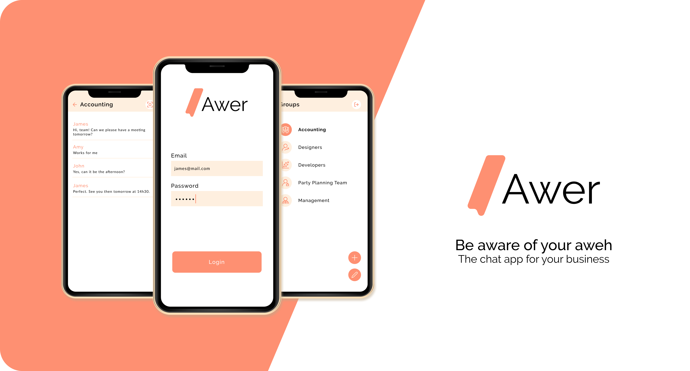
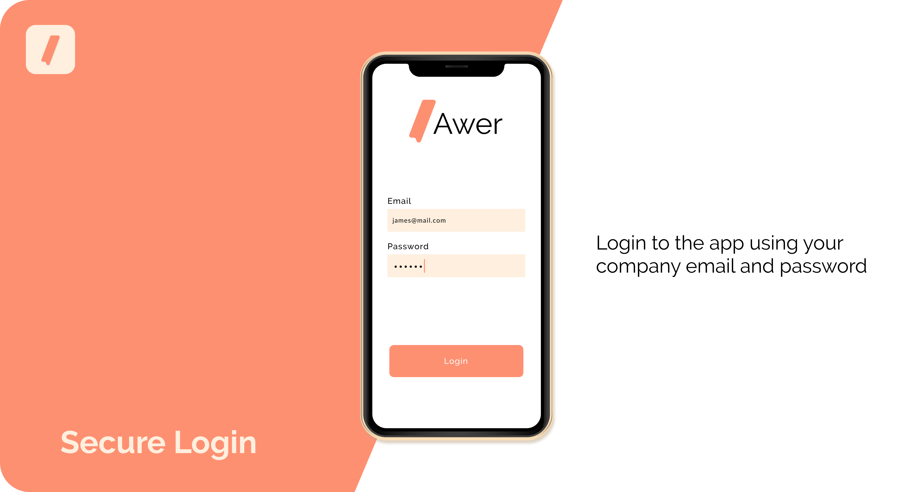
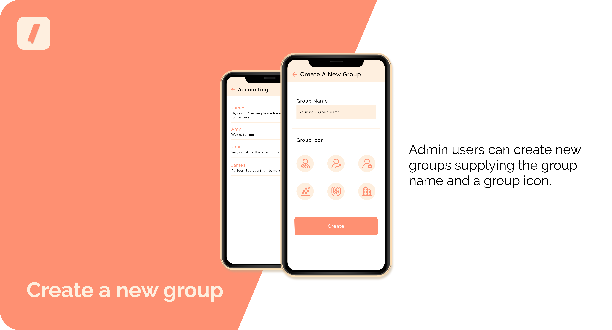
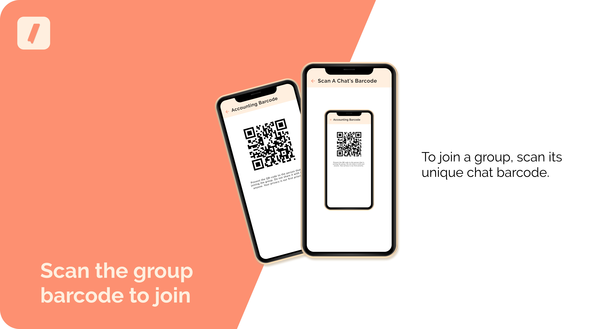
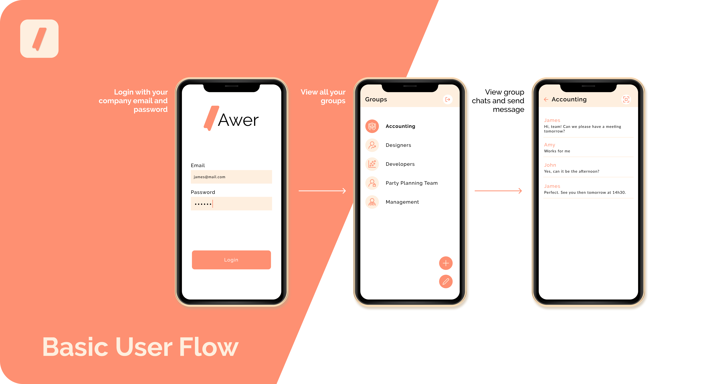

<!--Awer README.MD-->
<!--
*** I'm using markdown "reference style" links for readability.
*** Reference links are enclosed in brackets [ ] instead of parentheses ( ).
*** See the bottom of this document for the declaration of the reference variables
-->
[![Contributors][contributors-shield]][contributors-url]
[![Forks][forks-shield]][forks-url]
[![Stargazers][stars-shield]][stars-url]
[![LinkedIn][linkedin-shield]][linkedin-url]


<!-- PROJECT LOGO -->
<br />
<p align="center">
  <a href="https://github.com/ArmandPretorius/awer">
    
  </a>

  <h3 align="center">Awer</h3>

  <p align="center">
   <i>Be Aware of your Aweh </i><br/>
   The chat app for your business
    <br />
    <a href="https://github.com/ArmandPretorius/awer"><strong>Explore the docs »</strong></a>
    <br />
    <br />
    <a href="https://youtu.be/4Onb1EI6EY0">View Demo</a>
    ·
    <a href="https://github.com/ArmandPretorius/awer/issues">Report Bug</a>
    ·
    <a href="https://github.com/ArmandPretorius/awer/issues">Request Feature</a>
  </p>
</p>


<!-- TABLE OF CONTENTS -->
## Table of Contents

* [About the Project](#about-the-project)
  * [Built With](#built-with)
  * [Installation](#installation)
* [Features](#features)
  * [Secure Login](#login)
  * [Create Groups](#groups)
  * [Unique Group QR-Code](#barcode)
* [Usage](#usage)
* [Logic](#logic)
* [Contribution](#contribution)
* [License](#license)
* [Challenges](#challenges)
* [Contact](#contact)

<!-- ABOUT THE PROJECT -->
## About The Project



Awer is an Android application that is a closed-group chat application for a company who wants to keep their private information safe.

This Project is for my Term 2 major subject, Interactive Development, for which we were tasked to create a fimiliar chat app using Xamarin.Forms and Firebase.  Not anyone should be allowed to access the application and it should have a unique way of joining the conversation.


### Built With
This Android application was build using:
* [Xamarin.Forms](https://dotnet.microsoft.com/apps/xamarin/xamarin-forms)
* [C#](https://dotnet.microsoft.com/apps/xamarin/xamarin-forms)
* [Google Firebase](https://firebase.google.com/?gclid=CjwKCAiAws7uBRAkEiwAMlbZjlUEwraOgZNquxXnxj8mIRa5ZZycTH_j8nwlR25wfS9oWmjK2lID-xoCmVUQAvD_BwE)


### Installation

1. DownloadVisual Studio 2019 [https://visualstudio.microsoft.com/vs/](https://visualstudio.microsoft.com/vs/) and Include Xamarin Forms in the installation process
2. Clone the repo
```sh
git clone https:://github.com/ArmandPretorius/awer.git
```
3. Then open the project in Visual Studio

<!-- FEATURES -->
## Features

### Secure Login


Use your company email and password to log into the app securely.

### Create Groups


Admin at the company can create groups for teams by giving it a name and a icon.

### Unique Group QR-Code


To join a group, users can scan the groups unique QR-Code.

<!-- USAGE -->
## Usage

* Login with Email and Password.

* View all the groups that you have joined.

* Create a new group.

* Join a group by scanning the groups barcode.

* Open Group to send and receive messages.



To see a run through of the application, click below:

[View Demo](https://youtu.be/4Onb1EI6EY0)

<!-- Changes Made -->
## Challenges

* I'd like companies to register for the app.

* I'd like to impliment notifications.

* I'd also like to finish it for iOS as well.

<!-- LICENSE -->
## License

Distributed under the MIT License. See `LICENSE` for more information.


<!-- CONTACT -->
## Contact

Armand Pretorius - [@amplified_designs](https://www.instagram.com/amplified_designs/) - 170045@virtualwindow.co.za

Project Link: [https://github.com/ArmandPretorius/awer](https://github.com/ArmandPretorius/awer)


<!-- MARKDOWN LINKS & IMAGES -->
<!-- https://www.markdownguide.org/basic-syntax/#reference-style-links -->
[contributors-shield]: https://img.shields.io/github/contributors/ArmandPretorius/awer.svg?style=flat-square
[contributors-url]: https://github.com/ArmandPretorius/awer/graphs/contributors
[forks-shield]: https://img.shields.io/github/forks/ArmandPretorius/awer.svg?style=flat-square
[forks-url]: https://github.com/ArmandPretorius/awer/network/members
[stars-shield]: https://img.shields.io/github/stars/ArmandPretorius/awer.svg?style=flat-square
[stars-url]: https://github.com/ArmandPretorius/awer/stargazers
[issues-shield]: https://img.shields.io/github/issues/ArmandPretorius/awer.svg?style=flat-square
[issues-url]: https://github.com/ArmandPretorius/awer/issues
[license-shield]: https://img.shields.io/github/license/ArmandPretorius/awer.svg?style=flat-square
[license-url]: https://github.com/ArmandPretorius/awer/master/LICENSE.txt
[linkedin-shield]: https://img.shields.io/badge/-LinkedIn-black.svg?style=flat-square&logo=linkedin&colorB=555
[linkedin-url]: https://www.linkedin.com/in/armand-pretorius-293b3a18a
